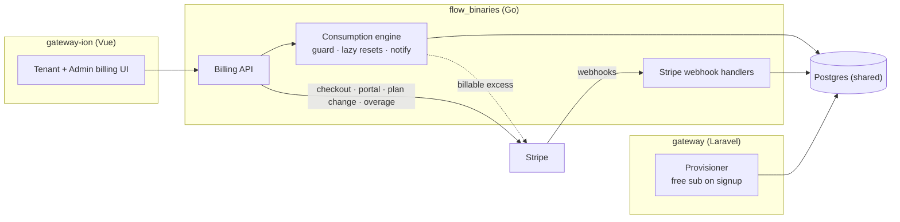
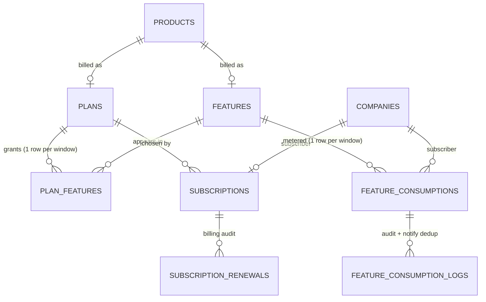
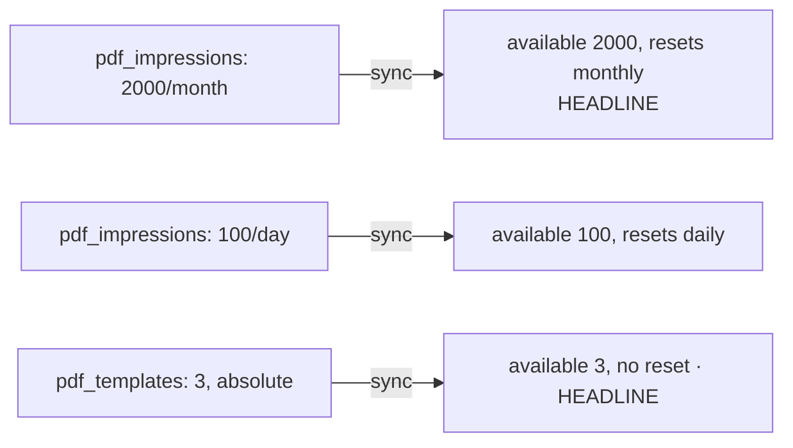
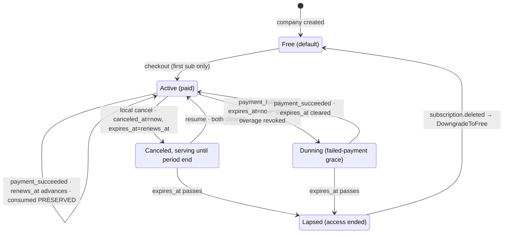
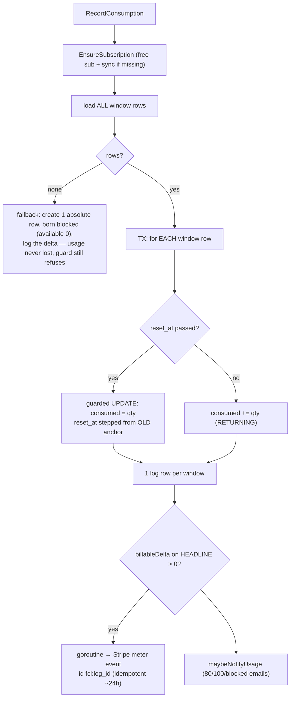
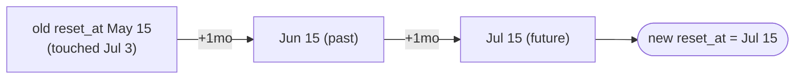
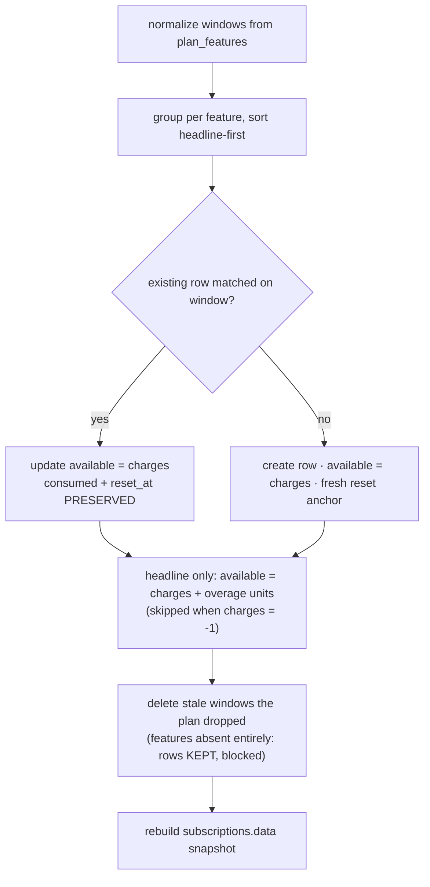
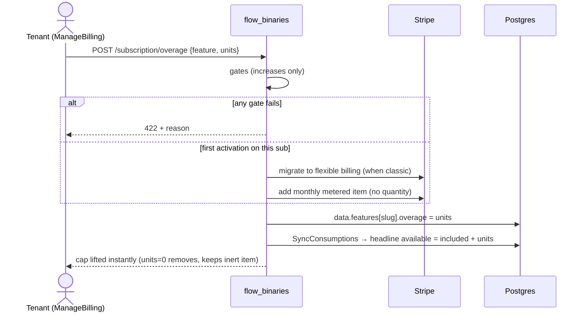
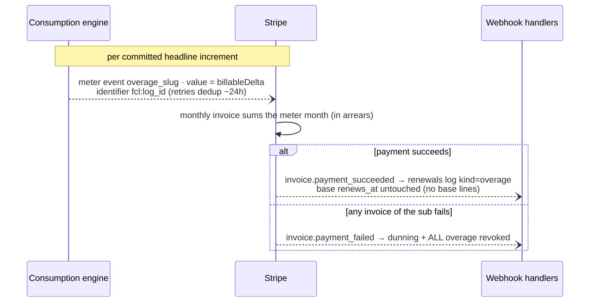

# IONF-1056 — Subscriptions & consumption metering · Prototype report

**What this prototype delivers:** per-company subscriptions, per-window consumption metering with lazy resets, timestamp-driven lifecycle synced from Stripe webhooks, and **usage-based overage billed via Stripe Billing Meters**. This report documents the observable business logic — every rule, branch, boundary, and expected outcome needed to exercise the system end to end.

| Repo | Owns |
|---|---|
| `gateway` (Laravel) | **All** schema (migrations/seeders), free-sub provisioning on company signup |
| `flow_binaries` (Go) | Runtime: consumption engine, Stripe webhook handlers, tenant + admin billing API |
| `gateway-ion` (Vue 3) | Tenant billing UI + admin plan/feature editor |

> `webcomponents-flow` still reads the old subscription shape — out of scope, separate ticket.

## System at a glance



**Core invariants** (hold at all times — the system's load-bearing rules):
- One subscription per company; free plan is the default and is auto-provisioned.
- `feature_consumptions` is the only source of truth for usage; `plan_features` for quotas. `subscription_renewals` and `feature_consumption_logs` are append-only audit — **logs, no logic**.
- No billing crons. Stripe webhooks drive lifecycle; consumption resets are **lazy** (applied when a row's `reset_at` is read or written past).
- Overage is billed by Stripe, not us. We report only billable excess; Stripe aggregates and invoices.
- Subscription state = timestamps (`canceled_at`, `expires_at`), never a `status` column.

## Data model



**Core idea:** a `plan_features` cell (allowance @ window) is *synced* into one `feature_consumptions` row per subscriber per window.



Columns that drive behavior:

| Column | Meaning / rule |
|---|---|
| `plan_features.charges` | Window allowance. `-1` = **unlimited** (never blocks, never bills). |
| `plan_features.period_unit` / `period_count` | The window. `NULL` unit = **absolute** (never resets). Unit set → count defaults to 1. Valid units: `day\|week\|month\|year`. |
| `feature_consumptions.consumed` / `available` | Current usage vs limit for this window. `available` = `charges` (+ overage units on the headline row). |
| `feature_consumptions.reset_at` | Next lazy reset; `NULL` = never. |
| `feature_consumptions.blocked` | Postgres **STORED generated** column: `available <> -1 AND consumed >= available`. App-read-only. |
| `subscriptions.data` | Entitlement snapshot (price purchased + per-feature `{overage, windows[{unit,count,included}]}`). Used for usage breakdown + notifications, **not** for blocking. |

**Window identity** = `(period_unit, period_count)`, NULL-safe. `feature_consumptions` has no unique index — sync enforces uniqueness via select-then-upsert.

**Headline window** = the absolute (NULL) row if present, else the longest period (year > month > week > day; tie → larger count, then lowest id). Usage display, notifications, and **overage billing** all measure against the headline.

## Subscription lifecycle

State is **derived** from timestamps — there is no status column.

| Derived state | Exact condition |
|---|---|
| Active | `canceled_at IS NULL AND (expires_at IS NULL OR expires_at > now)` |
| Canceled (still serving) | `canceled_at IS NOT NULL` — access until `expires_at` |
| Dunning | `canceled_at IS NULL AND expires_at IS NOT NULL` (failed payment) |
| Lapsed | `expires_at <= now` — cleared only by the `deleted` webhook |



**Exact writer effects** — the only places these timestamps change (everything else is derived):

| Trigger | `canceled_at` | `expires_at` | `renews_at` | Side effects |
|---|---|---|---|---|
| `subscription.created/updated` | from Stripe (`>0` else NULL) | from Stripe `cancel_at` (fallbacks: `cancel_at_period_end` → item period end → local `renews_at`) | max item `current_period_end` | plan/trial from Stripe; `data.price` snapshot; `SyncConsumptions` |
| Local cancel (`POST /subscription/cancel`) | now | `renews_at` | — | Stripe `cancel_at_period_end=true` |
| Local resume (`POST /subscription/resume`) | NULL | NULL | — | Stripe resume |
| `invoice.payment_succeeded` | — | NULL **only if** `canceled_at IS NULL` | max period end of **base-plan lines only** | `SyncConsumptions`; renewal log; **no** explicit consumed reset (lazy handles it) |
| `invoice.payment_failed` | — | now + `plan.grace_days_end` | — | dunning; **all overage revoked** (re-sync → caps back to plan); renewal log |
| `subscription.deleted` | NULL | NULL | NULL | `DowngradeToFree`: revoke overage, plan=free, clear Stripe ids + pending plan + `data.price`, re-sync; renewal log |

Rules that matter for correctness:
- **`renews_at` moves on base lines only** — a monthly overage invoice on a yearly base must not clobber the yearly renewal; overage-only invoices leave it untouched.
- **`payment_succeeded` never un-cancels** a user cancellation (`canceled_at` stays set).
- **Resume works because Stripe is mirrored verbatim** — a resumed sub arrives with empty timestamps; the upsert assigns both unconditionally (nil clears).
- **No reconciliation cron** — a missed `deleted` webhook leaves the row lapsed until Stripe redelivers.

## Consumption runtime & blocking

Two entry points in `backend/ion/services/`, both serialized by a per-`(subscriber, feature)` mutex.

### Guard — `GuardFeature` / `IsBlocked`

| Situation | Result |
|---|---|
| Infrastructure error (feature lookup / query fails) | **ALLOW** (fail-open — infra only) |
| Feature has **no rows** (unprovisioned for the plan) | **BLOCK** → `ErrQuotaBlocked` (403) + deduped blocked email + audit log |
| Any window row with `blocked = true` whose reset is **not** due | **BLOCK** (e.g. daily cap hit while monthly bag has units) |
| A blocked row whose `reset_at` **has** passed | **ALLOW** (about to roll over — can't block) |
| All rows under limit | **ALLOW** |

`ErrQuotaBlocked` skips the single run only — it never disables schedules or webhooks.

**Blocking boundaries** (per window row): `consumed >= available` blocks; `consumed = available - 1` allows; `available = 0` is always blocked; `available = -1` never blocks.

### Record — `RecordConsumption(slug, subscriber, qty)`



- One record increments **all** of the feature's window rows — one log row each.
- A lazy reset is *part of* the write: the new window starts at `qty` with `before=0` (it never sums across the boundary).
- Billing fires **strictly after commit**, fire-and-forget: a rolled-back write never bills; a failed meter call logs and at worst under-bills that one delta.
- **Reads persist resets too**: `GET /subscription/usage` zeroes due rows before returning, so the FE always sees real values and the real next `reset_at`.

### Lazy reset advancement (anchor lattice)

The next `reset_at` steps from the **old** anchor by `period_count × period_unit` until it lands in the future — **never re-anchored to "now"**, so day-of-month / midnight alignment never drifts.



| Window unit | Initial `reset_at` for a new row |
|---|---|
| `day` | now + count, start of day |
| `week` | now + count weeks |
| `month` / `year` | earliest future boundary on lattice `{renews_at + k·(count·unit)}` — a monthly window on a **yearly** base still resets monthly, on the renewal's day-of-month. Falls back to now + count without `renews_at`. |
| `NULL` (absolute) | NULL — never resets |

**Cross-replica safety:** the reset is a guarded `UPDATE ... WHERE id=? AND reset_at=<old>` — exactly one writer wins; losers re-read the fresh row and increment normally.

## Sync — `SyncConsumptions`

Same algorithm in Go and PHP. Triggered by: company signup, seeder backfill, first runtime touch (`EnsureSubscription`), every webhook upsert, and plan/overage changes.



- A **changed** window is, by definition, a **new** row (fresh anchor); the old one falls to stale cleanup.
- A sync **never** pushes `reset_at` forward without zeroing `consumed` (preserves both on match).
- Features the plan dropped entirely: rows are **kept** (born `available 0` → blocked), so usage is never lost but the guard refuses.

## Overage — Stripe Billing Meters (primary focus)

Billed **monthly in arrears on the SAME subscription**: a monthly *metered* item sits beside the base price. Yearly base + monthly overage works via Stripe **flexible billing mode**.

**Hard precondition (else 422):** the feature's product must carry a monthly **metered** price tagged `type=recurring AND recurring.usage_type="metered"` with a Billing Meter attached whose `event_name = overage_<slug>`.

### Activation — `POST /subscription/overage {feature, units}`



**Activation gates** — all apply to **increases only** (lowering/removal always allowed, including while canceled-but-serving). Each failure → **422** with the reason:

| Gate | Fails when |
|---|---|
| Paid subscription | no paid sub (free plan) |
| Not lapsed | `expires_at <= now` |
| Not dunning | failed-payment grace active |
| Plan meters the feature | feature not in the current plan / not overage-configured |
| Headline not unlimited | headline `available = -1` |

### Metering & billing (`billableDelta` clipping)

After each committed **headline** increment, the engine reports a meter event whose value is the portion of `[before, after]` that lands in the billable band `[included, included + overage]`:

```
billable = max(0, min(after, included+overage) − max(before, included))
```

| `included` | `overage` | `before` → `after` | Meter value | Why |
|---|---|---|---|---|
| 2000 | 500 | 1900 → 1950 | **0** | entirely below `included` |
| 2000 | 500 | 1900 → 2100 | **100** | only the part above 2000 bills |
| 2000 | 500 | 2050 → 2150 | **100** | fully inside the band |
| 2000 | 500 | 2400 → 2600 | **100** | clipped at `included+overage = 2500` (guard blocks past it) |
| 2000 | 0 | 2000 → 2050 | **0** | no overage → cap is `included`; guard blocks the write anyway |
| -1 (unlimited) | — | any | **0** | unlimited never bills |



**Guarantees worth exercising:**
- **billed ≤ units:** per-delta clipping + the guard blocking past-cap consumption means total billed in a meter month cannot exceed purchased units.
- **No double-bill on reset:** the reset-winner restarts at `before=0`, and clipping starts the band at `included`, so a lazy reset never re-bills already-billed usage.
- **Idempotency:** identifier `fcl:<log id>`; Stripe dashboard redelivery / retries within ~24h never double-count.
- **Exact across replicas:** headline increments use `RETURNING` for precise before/after.

**Overage interactions:**
- **Plan change:** immediate (`now`) path touches only the base item; deferred (`period_end`) schedule **re-states the metered items in BOTH phases** — a schedule replaces the whole item list, so without this the overage lines drop.
- **Failed payment:** revoking units stops future billable excess; excess already reported still invoices. Recovery clears dunning; the user **re-activates overage manually**.
- **Removal (`units=0`):** stops future deltas (already-reported usage still bills); keeps the inert metered item. **Lowering** caps future deltas only.

## Notifications

Email-only, measured against the snapshot's headline `included`:

| Event | Condition | Result |
|---|---|---|
| 80% warning | headline `consumed` reaches 80% of `included`, first time since last sync | email + log `notification_80` |
| 100% warning | reaches 100%, first time since last sync | email + log `notification_100` |
| Blocked | guard rejects a **consumable** feature (deduped) | email + log `blocked` |
| Quota feature blocked | guard rejects a `quota` feature | **silent** — audit log row only |

Dedup is **since the subscription's last sync** (`sub.UpdatedAt`), via headline-row log entries.

## Reference data

### Seed defaults (adjustable)

| feature \ plan | free | go | pro | ion |
|---|---|---|---|---|
| execution_time (s) | 600/mo | 3600/mo | 86400/mo | -1/mo |
| ai_credits | 100/mo | 100000/mo | 500000/mo | -1/mo |
| pdf_templates (quota) | 1 abs | 3 abs | -1 abs | -1 abs |
| pdf_impressions | 50/mo + 10/day | 2000/mo + 100/day | -1 | -1 |

`free` = default; `ion` = internal unlimited tier; `enterprise` seeds **no** features (custom per customer → the guard blocks everything until an admin configures its windows).

### Endpoints & status codes

**Tenant** (`/api/1.0/tenants/{id}/`, JWT + TenantAuth):

| Endpoint | Perm | Notes / codes |
|---|---|---|
| `GET /plans` | ReadBilling | public plans only |
| `GET /subscription` | ReadBilling | full row (plan, pending_plan, data, timestamps) |
| `GET /subscription/usage` | ReadBilling | real values; **persists lazy resets** |
| `POST /subscription/cancel` | ManageBilling | returns updated sub (canceled_at/expires_at set) |
| `POST /subscription/resume` | ManageBilling | returns updated sub (timestamps cleared) |
| `POST /checkout-session` | ManageBilling | **first sub only** → 409 otherwise |
| `POST /subscription/change-plan` | ManageBilling | `{plan_slug, interval?, when?}`; `now`=prorated, `period_end`=schedule + `pending_plan_id` |
| `POST /subscription/overage` | ManageBilling | `{feature_slug\|feature_id, units}`; gate failures → **422** + reason |
| `POST /billing-portal` | ManageBilling | Stripe portal session |

**Admin** (`/billing/...`): products list/get/sync/delete; plans CRUD; features list/update; plan-feature windows — `POST .../{planId}/features` adds **one** window row (same feature can be linked again with another window; duplicate window → unique error); `PUT\|DELETE .../{planFeatureId}` addressed by the plan_features row id (404 if not on that plan).

### Conventions

- `-1` = unlimited (never blocks, never bills).
- Normalize windows before every write: empty/NULL unit → NULL count (absolute); set unit → count defaults to 1.
- `stripe_customer_id` is indexed but **not unique** (companies sharing a contact email resolve to one Stripe customer); cached by webhook/checkout/overage so the meter reporter skips the email→customer lookup.
- `subscription_renewals` written **only** by flow_binaries webhook handlers, append-only, failures swallowed.

## Observable behaviors (expected outcomes)

A consolidated list of the externally checkable results, by area:

- **Provisioning:** new company → free subscription + `feature_consumptions` rows per seeded window. First runtime touch on a company with no sub creates one.
- **Lazy reset:** a row with `reset_at` in the past and `consumed > 0` → after a record, `consumed == qty` (not summed) and `reset_at` advanced from the **old** anchor; `GET /subscription/usage` persists the zero. `IsBlocked` is **true** for a no-rows feature, **false** for a due-but-blocked row.
- **Lifecycle (Stripe fixtures):** `cancel_at_period_end` → both timestamps set; resume → both cleared; `payment_failed` → `expires_at = now + grace`, `canceled_at` NULL, **overage zeroed** (headline back to plan), renewals row; later `payment_succeeded` → `expires_at` cleared, `renews_at` advanced from **base lines only**, `consumed` + `reset_at` preserved; success while canceled keeps `expires_at`; `deleted` → free plan, timestamps NULL, overage revoked, stale paid-only windows removed, renewals row.
- **Overage (Stripe test clock):** `units=N` → metered item on the same sub (billing mode flexible, migrated when classic), headline `available = included + N`, `stripe_customer_id` cached; consume past `included` → meter events with value = clipped excess and identifier `fcl:<log id>` (redelivery never double-counts); advance one month → monthly invoice carries the overage line (separate from a yearly base renewal); `units=0` → no further events, already-reported usage still bills.
- **Admin windows:** same feature with two windows → two rows; duplicate window → unique error; PUT/DELETE addressed by `planFeatureId`.
- **Frontend:** Canceled tag from `canceled_at`, "Cancels on {expires_at}", per-window bars each with its own real reset date.
