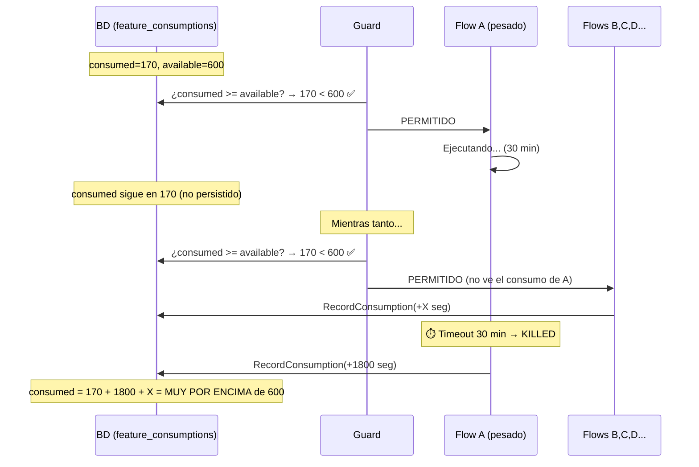
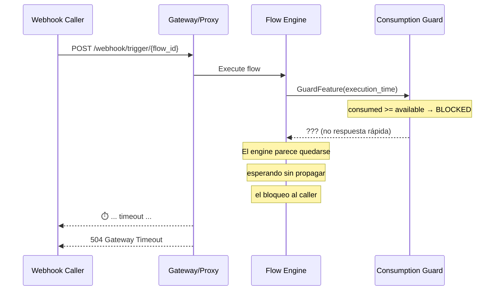
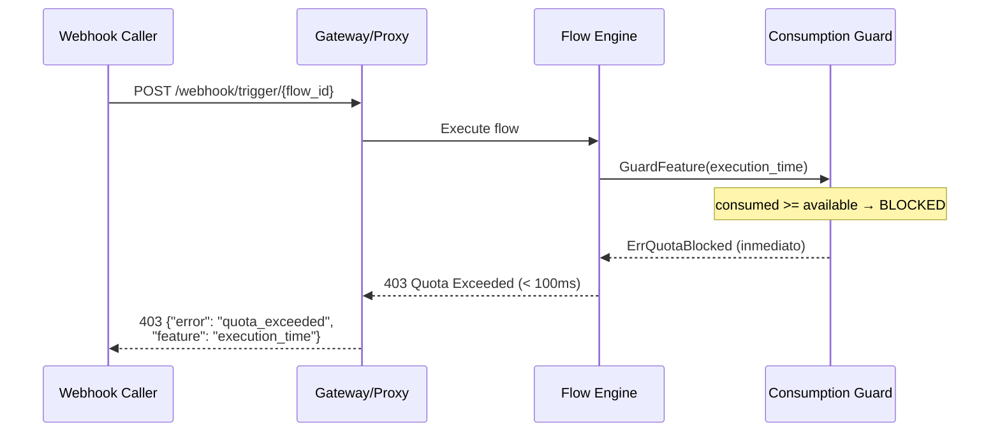
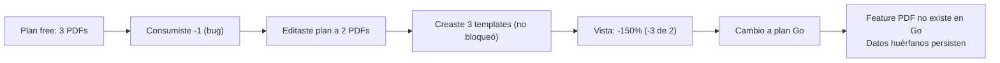
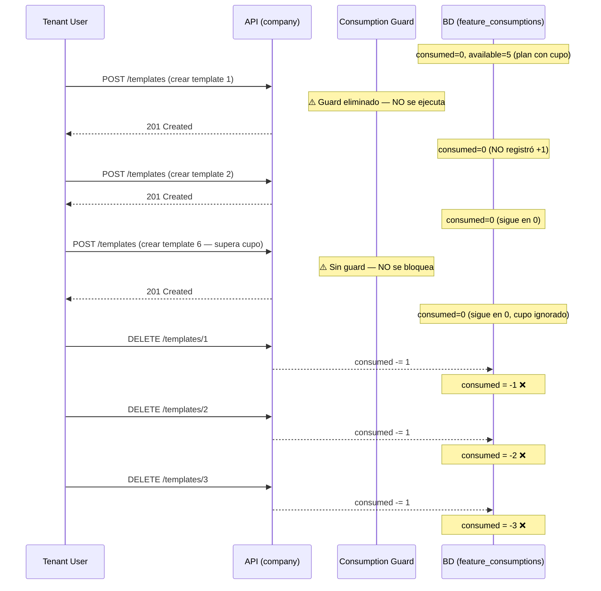

# Análisis de Observaciones de Testing — IONF-1056-B

> Ticket: IONF-1056-B (Zero-Stripe)
> QA Engineer: Steve Nina
> Fecha de análisis: 2026-07-29
> Basado en: [test-matrix.md](file:///c:/Users/STEVE/Desktop/Automation/ionflow-qa-catalyst/knowledge/L3-tickets/IONF-1056/test-matrix.md), [ac-consolidated.md](file:///c:/Users/STEVE/Desktop/Automation/ionflow-qa-catalyst/knowledge/L3-tickets/IONF-1056/ac-consolidated.md), [code-review-qa.md](file:///c:/Users/STEVE/Desktop/Automation/ionflow-qa-catalyst/knowledge/L3-tickets/IONF-1056/code-review-qa.md)

---

## Índice

1. [Timeout de ejecución larga y ejecuciones concurrentes](#1)
2. [TC-106 — Segundos de gracia al borde del límite](#2)
3. [TC-110 — Consumo decimal de AI credits (199.8 vs 200)](#3)
4. [TC-040/042/044 — Emails no enviados y multiusuario](#4)
5. [Webhook 504 timeout cuando execution_time bloqueado](#5-webhook)
6. [TC-070 — IONPDF standalone no se pudo asociar](#5)
7. [TC-072 — PDFs creados no registrados en ledger](#6)
8. [Suite 9 — Tablas de idle y units consumed](#7)
9. [Suite 1 — Provisioning y refresh de plans](#8)
10. [Suite 2 — Admin Assignment UX y consistencia](#9)
11. [Edición de plan y quota bypass](#10)
12. [BUG-03 — pdf_templates company: create sin guard/+1, delete registra -1](#12)
13. [Propuesta de Edge Cases adicionales](#13)

---

<a id="1"></a>
## 1. Timeout de ejecución larga y ejecuciones concurrentes

### Tu observación
> Un flow con carga pesada (200 elementos) fue matado en la iteración 50 por timeout de 30 min. La company ya tenía **170 seg consumidos de 600 disponibles** (por ejecuciones previas de otros flows). El flow pesado murió por timeout y se registró con status `stopped` + **1800 seg de consumo**. Total resultante: 170 + 1800 = **1970 seg consumidos de 600 disponibles**. Mientras el flow pesado estaba corriendo sus 30 min, otros flows de la misma company también se ejecutaron.

### Veredicto: 🔴 COMPORTAMIENTO INCORRECTO — Múltiples fallas de enforcement

| Aspecto | ¿Correcto? | Explicación |
|---------|------------|-------------|
| Status cambiado a `stopped` | ✅ Sí | Es el estado correcto cuando el runtime mata un flow por timeout |
| **Guard permitió el flow con 170/600 seg consumidos** | ✅ Sí | Al momento de iniciar, había 430 seg disponibles — el guard correctamente permitió la ejecución |
| **El flow consumió 1800 seg (30 min de timeout)** | ❌ **PROBLEMA** | El flow solo tenía 430 seg de saldo restante (600 - 170). El motor le permitió ejecutar durante 1800 seg (4.2x más de lo disponible). **No hay enforcement mid-execution** que detenga el flow cuando el saldo se agota |
| **Total: 1970 de 600 seg (328% de consumo)** | ❌ **PROBLEMA GRAVE** | El sistema permite consumir 3.2x el cap sin bloquear. El guard solo verifica al inicio, no durante la ejecución |
| **Otros flows se ejecutaron durante los 30 min** | ❌ **PROBLEMA** | Mientras el flow pesado estaba en ejecución (y su consumo no se había persistido aún), otros flows pasaron el guard porque este solo veía 170/600 en BD |

**Línea de tiempo del problema:**



> [!CAUTION]
> **Problemas identificados:**
> 1. **Sin enforcement mid-execution**: El guard solo verifica al inicio del flow. Si un flow consume más tiempo del saldo restante, no se detiene.
> 2. **Consumo no visible en tiempo real**: Mientras un flow está en ejecución, su consumo no se refleja en BD. Otros flows pasan el guard con datos obsoletos.
> 3. **El timeout de 30 min no es un límite de billing**: Es un timeout del runtime engine. El billing no tiene su propio mecanismo para detener un flow cuando se agota el saldo.

> [!IMPORTANT]
> **Preguntas para Enrique:**
> 1. ¿El guard se ejecuta **antes de cada flow** o solo en el pre-check inicial?
> 2. ¿Existe algún mecanismo de **enforcement mid-execution** que detenga un flow cuando `consumed` supera `available` durante la ejecución?
> 3. Si un flow ya está en ejecución y otro flow se lanza, ¿el guard verifica el saldo **incluyendo** los segundos que el flow en curso está consumiendo (pero que aún no se han persistido)?
> 4. ¿El consumo del flow debería registrarse como los **1800 seg del timeout** o como el **tiempo real de procesamiento** (que fue menor, interrumpido en iteración 50 de 200)?

> [!WARNING]
> Esto conecta directamente con **BUG-CR-006** del [code-review-qa.md](file:///c:/Users/STEVE/Desktop/Automation/ionflow-qa-catalyst/knowledge/L3-tickets/IONF-1056/code-review-qa.md#L200-L216): el `consumptionLocks` es in-process y no protege contra ejecuciones paralelas que consuman el mismo recurso. Si hay múltiples flows del mismo subscriber corriendo en paralelo, **cada uno puede pasar el guard** porque el consumo del otro aún no se persistió.

---

<a id="2"></a>
## 2. TC-106 — Segundos de gracia al borde del límite

### Tu observación
> Con 590 de 600 seg consumidos, el siguiente flow consume 40 seg. ¿Debería completarse como "gracia"? ¿Qué pasa si al mismo instante se lanzan 10-15 flows más?

### Veredicto: 🔴 PREGUNTA ABIERTA CRÍTICA (P-01)

Esto es exactamente la **pregunta P-01** que sigue sin resolver en [ac-consolidated.md](file:///c:/Users/STEVE/Desktop/Automation/ionflow-qa-catalyst/knowledge/L3-tickets/IONF-1056/ac-consolidated.md#L204):

| Escenario | Según AC-32 (descripción) | Según IONF-1056-B (comentarios) | ¿Cuál aplica? |
|-----------|---------------------------|--------------------------------|----------------|
| 590/600 seg → ejecutar flow de 40 seg | Se permite (grace execution) | Se bloquea directamente (hard block) | **⚠️ PENDIENTE** |
| 590/600 seg → 15 flows simultáneos | Grace permite 1, bloquea resto | Bloquea todos | **⚠️ PENDIENTE** |

**Lo que el código sugiere** (basado en [code-review-qa.md](file:///c:/Users/STEVE/Desktop/Automation/ionflow-qa-catalyst/knowledge/L3-tickets/IONF-1056/code-review-qa.md)):

El guard en `consumption_guard.go` verifica `consumed >= available` → **bloqueo directo**. No hay evidencia de grace execution en el código. Pero el AC original dice que sí debería existir.

**Comportamiento esperado (mi recomendación):**

| Opción | Comportamiento | Pro | Contra |
|--------|---------------|-----|--------|
| **A: Hard block** | Si `consumed >= available`, bloquea sin importar cuánto falte | Simple, predecible, seguro | Un flow que necesita 1 seg adicional se bloquea con 599/600 consumidos |
| **B: Grace execution** | Se permite 1 flow adicional después de llegar al 100%, luego bloquea | Mejor UX | Puede consumir significativamente más del límite (ej. flow de 2000 seg como "gracia") |
| **C: Soft check pre-execution** | El guard permite si `consumed < available` pero NO garantiza que el flow no supere el cap durante la ejecución | Balance | Permite empezar pero no controla cuánto consume el flow |

> [!CAUTION]
> **El caso de 15 flows simultáneos es crítico**: Sin importar si hay grace o no, el guard se ejecuta **antes** de cada flow. Si los 15 pasan el guard en el mismo instante (todos ven 590/600), **todos se ejecutarán** y el consumo total podría ser 590 + (15 × 40) = 1190 seg cuando el cap es 600. Este es un race condition real documentado en **BUG-CR-006**.

---

<a id="3"></a>
## 3. TC-110 — Consumo decimal de AI credits (199.8 vs 200)

### Tu observación
> En BD se ve consumed=199.8 de 200 credits. En UI dice 200 consumidos (100%). No está bloqueado y se puede hacer 1 petición más.

### Veredicto: ❌ **BUGS CONFIRMADOS (2 bugs)**

**Bug 1: Redondeo en UI**

| Campo | BD | UI | ¿Correcto? |
|-------|----|----|------------|
| consumed | 199.8 | 200 | ❌ **UI redondea al entero** cuando debería mostrar el valor real o al menos indicar "~200" |
| porcentaje | 99.9% | 100% | ❌ UI dice 100% pero la lógica de bloqueo usa el valor real (99.9%) |
| blocked | false | No bloqueado | ⚠️ **Correcto según la BD** (consumed < available), pero **incorrecto según lo que la UI comunica** |

**Bug 2: Posibilidad de exceder el límite por decimal**

```
Estado en BD: consumed=199.8, available=200
Saldo real restante: 0.2 credits
¿El próximo request puede pasar? → SÍ (0.2 > 0)
¿Ese request consumirá exactamente 0.2? → Probablemente NO (AI credits son variables)
Resultado: consumed puede llegar a ~201.5 → SOBREPASÓ EL LÍMITE
```

> [!WARNING]
> Este bug tiene **impacto económico directo**: si los AI credits tienen un costo (costo proveedor + margen × factor, según AC-ENT-04), el sistema está permitiendo consumo sin cobro.

**Comportamiento esperado:**
1. La UI debería mostrar el valor real (199.8) o indicar claramente "~200"
2. La UI debería decir "99.9%" no "100%"
3. **Decisión de producto**: ¿El bloqueo debería ser `consumed >= available` (bloquea a 200.0 exacto) o `available - consumed < umbral_mínimo`? Para AI credits que no son exactamente 1.0 por request, se debería definir una unidad mínima de consumo

---

<a id="4"></a>
## 4. TC-040/042/044 — Emails no enviados y multiusuario

### Tu observación
> No se envía correo electrónico. En `feature_consumption_logs` se guardó `notification_100` con source, reference_type, reference_id y metadata vacíos. ¿A quién se envía en multiusuario?

### Veredicto: ❌ **BUG — Email no enviado pero notificación registrada**

| Aspecto | Observado | Esperado | ¿Correcto? |
|---------|-----------|----------|------------|
| Log `notification_100` en BD | ✅ Se creó | ✅ Correcto | Sí |
| Campos vacíos (source, ref_type, ref_id, metadata) | ❌ Vacíos | Deberían tener valores | ❌ **Bug de datos incompletos** |
| Email recibido | ❌ No | ✅ Sí (según AC-33/34/35) | ❌ **Bug** |

**Diagnóstico probable**: El código de [consumption_notify.go](file:///c:/Users/STEVE/Desktop/Automation/ionflow-qa-catalyst/knowledge/L3-tickets/IONF-1056/code-review-qa.md#L99-L120) registra el log de notificación pero el envío real del email falla silenciosamente. El hecho de que los campos estén vacíos sugiere que el log se crea como "placeholder" antes de intentar el envío.

**Sobre multiusuario:**

| Pregunta | Respuesta esperada (basada en ACs) |
|----------|-------------------------------------|
| ¿A quién se envía? | Al **owner** del subscriber. Según AC-05 y AC-LED-02, el billing owner es `company`. El email debería ir al usuario registrado como contacto principal de la company |
| ¿Todos los usuarios de la company reciben email? | **No especificado en los ACs**. Esto es una pregunta abierta |
| ¿El admin también recibe? | **No especificado** |

> [!IMPORTANT]
> **Acción requerida**: Reportar como bug. El log se crea pero el email no se envía. Además, los campos vacíos en `feature_consumption_logs` necesitan ser poblados para trazabilidad.

---

<a id="5-webhook"></a>
## 5. Webhook 504 timeout cuando `execution_time` bloqueado

### Tu observación
> En un flow live que usa webhook como trigger, cuando los segundos están al tope y bloqueados, el webhook se queda esperando respuesta hasta que devuelve error 504 y muere por timeout sin una respuesta clara.

### Veredicto: ❌ **BUG CONFIRMADO — Falta fail-fast en webhook trigger cuando quota bloqueada**

| Aspecto | Observado | Esperado |
|---------|-----------|----------|
| Respuesta del webhook | ⏳ Espera → 504 Gateway Timeout | Debería retornar **inmediatamente** con un código claro |
| Tiempo de respuesta | 30+ seg (timeout del gateway/proxy) | < 1 seg (fail-fast) |
| Código HTTP | 504 (genérico) | **403** con body `{"error": "ErrQuotaBlocked", "message": "execution_time quota exceeded"}` o **429** (Too Many Requests) |
| Mensaje al caller | Ninguno (timeout genérico) | Mensaje descriptivo de que la ejecución está bloqueada por quota |

**Diagnóstico del flujo actual:**



**Flujo esperado (correcto):**



> [!CAUTION]
> **Impacto alto**: Este bug afecta a **todos los flows live con webhook trigger** cuando la company tiene `execution_time` bloqueado. El caller externo (ej. un e-commerce, un webhook de MercadoLibre, Shopify, etc.) recibe un 504 genérico, lo que puede causar:
> - **Retries automáticos** del caller (muchos sistemas reintentan en 504) generando carga innecesaria
> - **Pérdida de datos** si el caller descarta el evento después de N retries fallidos
> - **Confusión del usuario** que ve errores 504 sin saber que es por quota de billing
> - **Logs contaminados** con timeouts que no apuntan a la causa real

Esto conecta directamente con [AC-27](file:///c:/Users/STEVE/Desktop/Automation/ionflow-qa-catalyst/knowledge/L3-tickets/IONF-1056/ac-consolidated.md#L86): "schedules y webhooks permanecen activos, solo la ejecución del flow termina inmediatamente". La palabra clave es **inmediatamente** — el 504 contradice esto.

---

<a id="5"></a>
## 6. TC-070 — IONPDF standalone no se pudo asociar

### Tu observación
> No fue posible asociar IONPDF standalone

### Veredicto: ⚠️ **NECESITA MÁS INFORMACIÓN — pero probablemente bug**

Según [AC-51](file:///c:/Users/STEVE/Desktop/Automation/ionflow-qa-catalyst/knowledge/L3-tickets/IONF-1056/ac-consolidated.md#L148): el admin debería poder asignar un plan IONPDF standalone a una company sin IONFLOW.

**Posibles causas:**
1. **No existe plan IONPDF en el catálogo de planes** → Verificar BD: `SELECT * FROM plans WHERE slug LIKE '%ionpdf%'` o nombre similar
2. **El plan IONPDF no aparece en el dropdown de Admin → Companies → Subscription tab** → Bug de UI
3. **El `PlanSeeder` o `PlanFeatureSeeder` no creó las features de IONPDF** → Verificar: `SELECT * FROM plan_features WHERE plan_id = <ionpdf_plan_id>`

> [!NOTE]
> Esto conecta con el riesgo **R-27** del [risk-triage.md](file:///c:/Users/STEVE/Desktop/Automation/ionflow-qa-catalyst/knowledge/L3-tickets/IONF-1056/risk-triage.md#L78): "Especificación final de IONPDF depende de trabajo previo de Rodolfo Merlo". Es posible que IONPDF standalone no esté completamente implementado en IONF-1056-B.

---

<a id="6"></a>
## 7. TC-072 — PDFs creados no registrados en ledger

### Tu observación
> No se registran los PDFs creados, ¿es correcto?

### Veredicto: ❌ **BUG — según AC-54**

Según [AC-54](file:///c:/Users/STEVE/Desktop/Automation/ionflow-qa-catalyst/knowledge/L3-tickets/IONF-1056/ac-consolidated.md#L151): "El consumo de IONPDF queda registrado en el ledger unificado". Los logs deberían existir en `feature_consumption_logs` con dimensiones de IONPDF.

| Qué verificar | Query |
|----------------|-------|
| ¿Existe el feature `pdf_templates` en el plan? | `SELECT * FROM features WHERE slug = 'pdf_templates'` |
| ¿Existe feature_consumption para el subscriber? | `SELECT * FROM feature_consumptions WHERE feature_id IN (SELECT id FROM features WHERE slug IN ('pdf_templates', 'pdf_impressions'))` |
| ¿Se creó log? | `SELECT * FROM feature_consumption_logs WHERE feature_consumption_id IN (...)` |

**Si no hay logs**: El `RecordConsumption` no se está ejecutando cuando se crea un template PDF. El guard probablemente existe pero el registro de consumo no está integrado.

---

<a id="7"></a>
## 8. Suite 9 — Tablas de idle y units consumed

### Tu pregunta
> ¿En qué tablas puedo ver la info de idle y units consumed?

### Veredicto: ✅ **CONFIRMADO — Los datos se están guardando correctamente**

El QA Engineer confirmó que `active_seconds`, `idle_seconds` y `units_consumed` sí se están registrando y guardando correctamente en la base de datos. Los TCs de esta suite (TC-080 a TC-084) pueden proceder con la verificación detallada de valores.

---

<a id="8"></a>
## 9. Suite 1 — Provisioning y refresh de plans

### Tu observación 1
> Modifiqué planes y en una company existente no se reflejan los cambios, pero sí al crear una nueva company.

### Veredicto: ✅ **COMPORTAMIENTO CORRECTO (con matiz)**

| Caso | Comportamiento | ¿Correcto? | Razón |
|------|---------------|------------|-------|
| Company existente no ve cambios de plan | ✅ Correcto | Sí | La company existente tiene una suscripción con `feature_consumptions` ya creadas. Modificar el plan no re-sincroniza automáticamente las companies existentes |
| Company nueva sí ve los cambios | ✅ Correcto | Sí | Al crear, se ejecuta auto-provisioning con los valores actuales del plan |

**Sin embargo**, si el admin **reasigna el plan** (incluso el mismo plan), debería ejecutar `SyncConsumptions` y actualizar los valores. Esto es el comportamiento esperado de AC-B02.

> [!NOTE]
> **Esto es diseño intencional**: los cambios de plan no son retroactivos. Para que una company existente reciba los nuevos valores, el admin debe reasignar el plan (o se debe implementar un mecanismo de "propagación" que no existe actualmente).

### Tu observación 2
> Al crear una company no se crea un subscriber_id. Si navego a subscriptions la vista no carga los features, pero al hacer refresh sí los trae.

### Veredicto: ⚠️ **BUG DE TIMING / RACE CONDITION**

| Aspecto | Observado | Esperado |
|---------|-----------|----------|
| subscriber_id no creado inmediatamente | ❌ | Debería crearse síncronamente al crear la company (AC-01) |
| Vista de subscriptions no carga features | ❌ | Deberían estar disponibles inmediatamente |
| Refresh trae los features | ✅ | Funciona pero con delay |

**Diagnóstico**: Esto conecta con **BUG-CR-001** del [code-review-qa.md](file:///c:/Users/STEVE/Desktop/Automation/ionflow-qa-catalyst/knowledge/L3-tickets/IONF-1056/code-review-qa.md#L68-L96). El auto-provisioning probablemente se ejecuta de forma **asíncrona o lazy** — la suscripción se crea cuando se accede por primera vez al billing, no al crear la company. El "refresh" funciona porque en ese segundo request el `GetByEntity` ya creó la suscripción.

---

<a id="9"></a>
## 10. Suite 2 — Admin Assignment UX y consistencia

### Observación 1: Botón no se bloquea con latencia
> El botón "Assign plan" salta la animación pero no se bloquea cuando hay latencia. Se puede presionar más de una vez. El dropdown debería bloquearse para no seleccionar otro plan.

### Veredicto: ❌ **BUG DE UX**

| Componente | Estado | Esperado |
|-----------|--------|----------|
| Botón "Assign plan" | No se deshabilita durante request | ✅ Debería estar disabled hasta que responda el backend |
| Dropdown de planes | Sigue activo durante request | ✅ Debería estar disabled |
| Múltiples clicks | Permite múltiples requests | ❌ **Puede causar asignaciones duplicadas o race conditions** |

> [!WARNING]
> En [CompanySubscription.vue](file:///c:/Users/STEVE/Desktop/Automation/ionflow-qa-catalyst/knowledge/L3-tickets/IONF-1056/code-review-qa.md#L59) (+174 líneas), el componente debería tener un estado `loading` que deshabilite tanto el botón como el dropdown durante la operación. Este es un bug de UX estándar.

### Observación 2: Cambio de free a go, ¿se resetean consumos?
> Si cambio de free a go, ¿deberían resetearse todos los consumos?

### Veredicto: ⚠️ **COMPORTAMIENTO NO ESPECIFICADO — Pero el código NO resetea**

Esto es exactamente **BUG-CR-005** del [code-review-qa.md](file:///c:/Users/STEVE/Desktop/Automation/ionflow-qa-catalyst/knowledge/L3-tickets/IONF-1056/code-review-qa.md#L173-L196):

```
Antes:  consumed=800, available=1000 (plan free)
Después: consumed=800, available=10000 (plan go)
```

**El `consumed` NO se resetea.** El código solo actualiza `available`. Esto puede ser intencional (preservar historial de consumo) o un bug.

### Observación 3: Consumo negativo de feature que no existe en el nuevo plan
> En free tenía límite 3 PDFs, consumí -1 (inconsistencia), y en go esa feature no existe. ¿Debería salir error cuando haga la primera query?

### Veredicto: ❌ **BUG — Datos huérfanos**

| Estado | Valor | Problema |
|--------|-------|----------|
| `consumed = -1` en free | ❌ | Valor negativo no debería existir |
| Feature no existe en go | ⚠️ | Las `feature_consumptions` del plan anterior quedan huérfanas |
| ¿Qué pasa al consultar? | Depende del guard | Si `isBlocked` retorna `true` por `len(rows) == 0` para esa feature, la feature queda bloqueada correctamente. Pero si las filas huérfanas persisten con `consumed=-1`, el guard podría interpretarlas incorrectamente |

### Observación 4: Quota de PDF templates no se bloquea
> Edité el plan free para 2 PDFs como quota y pude crear 3. La vista muestra -150% (-3 de 2 templates). No se bloqueó la creación.

### Veredicto: ❌ **BUG CONFIRMADO — Enforcement de pdf_templates no funciona**

Según [AC-28](file:///c:/Users/STEVE/Desktop/Automation/ionflow-qa-catalyst/knowledge/L3-tickets/IONF-1056/ac-consolidated.md#L87): "`pdf_templates` agotado: bloquea la creación de nuevos templates".

| Lo que pasó | Lo que debería pasar |
|-------------|---------------------|
| Se crearon 3 templates con quota de 2 | La creación del 3er template debería haber sido bloqueada |
| Vista muestra -150% (-3 de 2) | Debería mostrar 100% y "Bloqueado" |
| No se bloqueó | El guard debería retornar 403 al intentar crear el 3er template |

> [!CAUTION]
> **Esto es un bug de enforcement, no solo de UI**. El backend no está ejecutando el guard al crear PDF templates, o el guard no está verificando `pdf_templates` correctamente.

---

<a id="10"></a>
## 11. Edición de plan y quota bypass

Resumo el caso completo del flujo que observaste:



**Resumen de bugs en este flujo:**
1. ❌ `consumed = -1` (valor negativo imposible)
2. ❌ Editar quota del plan no re-sincroniza companies existentes (puede ser by design)
3. ❌ Enforcement de `pdf_templates` no bloquea creación
4. ❌ Cambio de plan no limpia features huérfanas
5. ❌ UI permite valores negativos de porcentaje (-150%)

---

<a id="12"></a>
## 12. BUG-03 — pdf_templates company: create sin guard/+1, delete registra -1

### Observación
> Al crear varios templates PDF desde un tenant con plan que incluye cupo de `pdf_templates`, ninguna creación se bloquea ni registra consumo (+1). Sin embargo, al eliminar templates, cada eliminación sí registra -1 en `feature_consumptions.consumed`. El resultado es un consumed negativo que hace el cupo inaplicable.

### Veredicto: 🔴 **BUG CONFIRMADO — Guard y +1 eliminados en create de company, -1 permanece en delete**

| Aspecto | Comportamiento actual | Comportamiento esperado | ¿Correcto? |
|---------|----------------------|------------------------|------------|
| Guard en create (company) | ❌ No existe — se eliminó en commit `b1fb4a96` | Debería validar `consumed >= available` antes de permitir la creación | ❌ **Bug** |
| +1 en create (company) | ❌ No se registra — se eliminó en commit `b1fb4a96` | Debería registrar `consumed += 1` al crear exitosamente | ❌ **Bug** |
| -1 en delete (company) | ✅ Sí se registra | Correcto, debería registrar `consumed -= 1` al eliminar | ✅ Correcto (pero sin el +1 causa negativo) |
| consumed resultante | ❌ Negativo (ej. -3 tras eliminar 3 templates) | Debería reflejar `templates_existentes` (≥ 0) | ❌ **Bug** |
| Variante account | ✅ Conserva guard + ambas operaciones (+1 y -1) | — | ✅ Referencia correcta |

**Causa raíz**: El commit `b1fb4a96` eliminó el guard y el registro de `+1` del flujo de creación de PDF templates a nivel de **company**, pero dejó intacto el registro de `-1` en el delete. La variante de **account** no fue afectada y conserva ambas operaciones correctamente.

**Archivo afectado**: `backend/ion/services/pdf_template_service.go` (líneas 94–229)

**Pasos de reproducción:**
1. Login como Tenant User (company con plan que incluye cupo de `pdf_templates`)
2. Crear varios templates PDF superando cualquier cupo teórico
3. Verificar que ninguna creación se bloquea ni registra consumo en `feature_consumptions`
4. Eliminar 3 templates
5. Consultar `feature_consumptions.consumed` de `pdf_templates`
6. Observar que `consumed` es **negativo** (-3)

**Línea de tiempo del problema:**



**Comparación entre variantes:**

| Operación | Variante `company` (rota) | Variante `account` (correcta) |
|-----------|--------------------------|-------------------------------|
| Create — Guard | ❌ Eliminado | ✅ Valida cupo antes de crear |
| Create — +1 | ❌ Eliminado | ✅ Registra `consumed += 1` |
| Delete — -1 | ✅ Registra `consumed -= 1` | ✅ Registra `consumed -= 1` |
| Consistencia | ❌ consumed puede ser negativo | ✅ consumed refleja templates reales |

> [!CAUTION]
> **Impacto**:
> 1. **Cupo inaplicable**: Sin guard en create, cualquier tenant puede crear templates ilimitados independientemente de su plan
> 2. **Consumed negativo**: La auditoría/logs muestran eliminaciones sin creaciones previas, generando datos inconsistentes
> 3. **Facturación incorrecta**: Si el billing depende de `consumed` para calcular uso, los valores negativos distorsionan los reportes
> 4. **Detección en auditoría**: Logs con `consumed < 0` son un indicador claro de este bug — patrón: solo `-1` sin `+1` previos

> [!IMPORTANT]
> **Prioridad**: P1 — El guard eliminado significa que **no hay enforcement** de cupo de PDF templates a nivel de company. Es un bypass completo de la limitación del plan.

> [!WARNING]
> **Repo**: `flow_binaries` | **Commit**: `b1fb4a96` | El fix debería restaurar tanto el guard como el `+1` en el flujo de create de company, usando la variante de account como referencia.

---

<a id="13"></a>
## 13. Propuesta de Edge Cases Adicionales

### EDGE CASES: Conexión, Latencia y Estrés

Estos son los casos que pediste que proponga, dentro del contexto de la matriz existente:

| EC-ID | Categoría | Caso de prueba | Pasos de reproducción | Comportamiento esperado | Prioridad |
|-------|-----------|----------------|----------------------|------------------------|-----------|
| **EC-NET-001** | 🌐 Latencia de red | Flow en ejecución + pérdida de conexión a BD momentánea durante `RecordConsumption` | 1. Flow ejecutando con conexión normal<br>2. Introducir latencia de red (ej. proxy con delay 5s) o cortar conexión brevemente<br>3. El flow finaliza pero `RecordConsumption` falla por timeout de BD | El flow debe completarse (AC-30: fail-open). El consumo debe registrarse eventualmente o al menos loggearse el error. **NO debería quedarse el consumo sin registrar silenciosamente** | 🔴 |
| **EC-NET-002** | 🌐 Conexión | Asignación de plan admin durante pérdida de conexión | 1. Admin presiona "Assign plan"<br>2. La conexión se corta mid-request<br>3. El backend ejecutó `AdminAssignPlan` parcialmente | `AdminAssignPlan` es transaccional ([code-review-qa.md](file:///c:/Users/STEVE/Desktop/Automation/ionflow-qa-catalyst/knowledge/L3-tickets/IONF-1056/code-review-qa.md#L249)). Si la conexión se corta, la TX debería hacer rollback. Verificar que no queda en estado inconsistente (plan cambiado pero `feature_consumptions` sin sync) | 🔴 |
| **EC-NET-003** | 🌐 Latencia | Guard con alta latencia de BD — ¿se permite o se bloquea el flow? | 1. Configurar latencia de 10s en conexión a BD<br>2. Intentar ejecutar flow<br>3. El guard tarda 10s en responder | Según AC-30 (fail-open): si el guard falla por timeout, la ejecución **se permite**. Pero ¿10s de latencia es "fallo"? ¿O simplemente espera? Verificar el timeout del guard | 🟠 |
| **EC-RACE-001** | 🏎️ Concurrencia | 10 flows del mismo subscriber lanzados simultáneamente con saldo justo para 5 | 1. Company con `execution_time: consumed=400, available=600`<br>2. Lanzar 10 flows simultáneamente (vía webhooks o scripts)<br>3. Cada flow consume ~40 seg<br>4. Solo 5 deberían caber (200 seg restantes / 40 seg cada uno) | Solo ~5 flows deberían completarse. Los demás deberían ser bloqueados por el guard. **RIESGO CONOCIDO**: el guard es in-process (`sync.Map`), así que en un solo proceso podría funcionar, pero en multi-replica no | 🔴 |
| **EC-RACE-002** | 🏎️ Concurrencia | AI credits: 20 requests rápidos al chat con 5 credits restantes | 1. `ai_credits: consumed=195, available=200`<br>2. Enviar 20 mensajes rápidos al flow-pilot<br>3. `recordGlobalConsumption` es asíncrono (`go cs.recordGlobalConsumption`) | Máximo ~5 requests deberían procesarse. Los 15 restantes deberían recibir SSE "reached your AI credits limit". **RIESGO**: [BUG-CR-003](file:///c:/Users/STEVE/Desktop/Automation/ionflow-qa-catalyst/knowledge/L3-tickets/IONF-1056/code-review-qa.md#L124-L143) — la persistencia asíncrona puede permitir que pasen más de 5 | 🔴 |
| **EC-RACE-003** | 🏎️ Concurrencia | Lazy reset + consumo simultáneo: dos flows al mismo tiempo con `reset_at` vencido | 1. Feature con `reset_at` vencido y `consumed=500`<br>2. Dos flows se lanzan simultáneamente<br>3. Ambos detectan `reset_at` vencido e intentan `applyLazyReset` | Solo uno debería ganar el reset (optimistic locking `WHERE reset_at = ?`). El otro debería reintentar o usar el valor ya reseteado. `consumed` final debe ser correcto | 🟠 |
| **EC-STRESS-001** | 💥 Estrés | 100 flows del mismo subscriber en ráfaga de 1 segundo | 1. Company con saldo amplio (ej. plan go, 10000 seg)<br>2. Lanzar 100 flows vía webhook en 1 segundo<br>3. Verificar `feature_consumptions` y `feature_consumption_logs` | Todos los 100 deberían ejecutarse (hay saldo). `consumed` final = suma de todos los tiempos. Verificar que no hay duplicación ni pérdida de registros en logs. Verificar performance del guard bajo carga | 🟠 |
| **EC-STRESS-002** | 💥 Estrés | Email de notificación en ráfaga: 50 flows cruzan el 80% al mismo tiempo | 1. Company con `consumed` justo por debajo del 80%<br>2. 50 flows se ejecutan y todos cruzan el 80% simultáneamente<br>3. ¿Se envían 50 emails o solo 1? | Solo 1 email por la deduplicación (`alreadyNotified` en [consumption_notify.go](file:///c:/Users/STEVE/Desktop/Automation/ionflow-qa-catalyst/knowledge/L3-tickets/IONF-1056/code-review-qa.md#L247)). Pero verificar que la deduplicación funciona bajo concurrencia | 🟠 |
| **EC-TIMEOUT-001** | ⏱️ Timeout | Flow que excede el timeout de 30 min: ¿qué consumed se registra? | 1. Flow diseñado para tomar >30 min (200 nodos con delays)<br>2. El runtime lo mata a los 30 min<br>3. ¿`consumed` registra el tiempo real procesado o los 30 min completos? | Debería registrar **el tiempo real de ejecución** (no el timeout completo). Si registra 1800 seg fijos, es un bug — el consumo real podría ser menor | 🟠 |
| **EC-TIMEOUT-002** | ⏱️ Timeout | Flow matado por timeout: ¿se ejecuta `RecordConsumption`? | 1. Flow que excede timeout<br>2. Runtime mata el flow<br>3. ¿El consumo se registra? ¿El log se crea? | El runtime debe asegurarse de llamar `RecordConsumption` con el tiempo real antes de finalizar, incluso en caso de timeout. Si no se registra, el consumo se pierde | 🔴 |
| **EC-PARTIAL-001** | 💔 Fallo parcial | Flow con 10 nodos: falla en nodo 5 — ¿se registra consumo parcial? | 1. Flow de 10 nodos<br>2. Nodo 5 falla (ej. API externa down)<br>3. ¿Se registran los 5 nodos ejecutados? | Sí, debería registrarse el consumo parcial (segundos reales usados). El status del flow debería ser `error`, no `completed` | 🟠 |
| **EC-PARTIAL-002** | 💔 Fallo parcial | PDF node falla mid-execution (`pdf_impressions` agotado): ¿se registran los nodos previos? | 1. Flow con nodos A → B → PDF → C<br>2. `pdf_impressions` se agota justo en el nodo PDF<br>3. ¿El consumo de A y B se registra? | Sí (AC-29). El flow queda en `error`. Los nodos A y B ya consumieron tiempo y debe registrarse. El nodo PDF falla con error de quota | 🟠 |
| **EC-ORPHAN-001** | 🧹 Datos huérfanos | Cambio de plan: features del plan anterior que no existen en el nuevo | 1. Company en plan free con `pdf_templates` (consumed=2, available=3)<br>2. Admin cambia a plan que no tiene `pdf_templates`<br>3. ¿Qué pasa con la fila de `feature_consumptions` huérfana? | Opciones: (a) se elimina, (b) se pone `available=0`, (c) se queda tal cual. El guard debería ignorar features que no pertenecen al plan actual | 🟠 |
| **EC-ORPHAN-002** | 🧹 Datos huérfanos | Company con datos de consumo de un plan cancelado + nuevo plan asignado | 1. Company con plan go, consumed=5000/10000 seg<br>2. Admin asigna plan free (1000 seg)<br>3. `consumed=5000, available=1000` → ya sobrepasado | El sistema debería detectar que consumed > available y bloquear inmediatamente. Verificar que la UI muestra esto correctamente (ej. "500% consumido") | 🟠 |
| **EC-MIGRATE-001** | 🔄 Migración | Company existente (pre-billing) ejecuta su primer flow después de activar billing | 1. Company que existía antes del deploy de IONF-1056-B<br>2. No tiene suscripción ni `feature_consumptions`<br>3. Ejecuta un flow por primera vez post-deploy | `GetByEntity` debe auto-provisionar plan free → `SyncConsumptions` → guard permite (BUG-CR-001 scenario). Si hay delay, el primer flow podría bloquearse temporalmente | 🔴 |

### EDGE CASES: Interacción entre sistemas

| EC-ID | Categoría | Caso de prueba | Comportamiento esperado | Prioridad |
|-------|-----------|----------------|------------------------|-----------|
| **EC-CROSS-001** | 🔗 PHP↔Go | Consulta de AI credits: PHP guard permite, Go guard lazy-resetea, PHP guard consulta de nuevo | Después del lazy reset del Go guard, la próxima consulta del PHP guard debería ver `consumed=0`. Si el PHP guard cacheó el valor anterior, podría mostrar datos incorrectos | 🟠 |
| **EC-CROSS-002** | 🔗 Guard timing | Guard permite flow → flow consume más del saldo → ¿segundo flow se bloquea? | El guard del segundo flow debe ver el saldo actualizado por el primer flow. Si el primer flow aún está en ejecución y su consumo no se persistió, el segundo flow también pasará el guard | 🔴 |
| **EC-CROSS-003** | 🔗 Admin + execution | Admin reasigna plan MIENTRAS un flow está en ejecución | El flow en ejecución debería completarse. Al terminar, `RecordConsumption` debería usar los nuevos valores del plan. Si `available` bajó (ej. go→free), el consumed podría superar el nuevo available | 🟠 |

### EDGE CASES: Webhook con quota bloqueada

| EC-ID | Categoría | Caso de prueba | Pasos de reproducción | Comportamiento esperado | Prioridad |
|-------|-----------|----------------|----------------------|------------------------|-----------|
| **EC-WH-001** | 🔗 Webhook + Guard | Webhook trigger con `execution_time` bloqueado: ¿respuesta inmediata o timeout? | 1. Company con `execution_time` bloqueado<br>2. Enviar POST al webhook del flow<br>3. Medir tiempo de respuesta y código HTTP | Respuesta **inmediata** (<1s) con **403** y body descriptivo. NO debería devolver 504 por timeout | 🔴 |
| **EC-WH-002** | 🔗 Webhook retry storm | Webhook que recibe 504 → caller reintenta N veces → ¿se acumulan requests colgados? | 1. Company bloqueada<br>2. Webhook caller con retry policy (ej. 3 retries con backoff)<br>3. ¿Los 3+1 requests se quedan colgados simultáneamente o el primero libera antes del retry? | Todos deberían responder 403 inmediato. Si se quedan colgados, N retries × M webhooks activos = **acumulación de conexiones que puede degradar el servidor** | 🔴 |
| **EC-WH-003** | 🔗 Webhook + desbloqueo | Webhook falla por quota → admin agrega saldo (reasigna plan) → ¿el próximo webhook funciona sin restart? | 1. Webhook devuelve 403 (o 504 en estado actual)<br>2. Admin reasigna plan con más saldo<br>3. Enviar nuevo webhook trigger<br>4. ¿El flow se ejecuta correctamente? | Sí, el guard debería permitir la ejecución con el nuevo saldo. No debería requerir reconfigurar el webhook | 🟠 |

---

## Resumen Ejecutivo

### Bugs confirmados encontrados

| # | Severidad | Descripción | TC relacionado |
|---|-----------|-------------|----------------|
| 1 | 🔴 | Enforcement de `pdf_templates` no bloquea creación — se puede exceder quota | TC-033 |
| 2 | 🔴 | Emails de notificación (80%/100%/blocked) no se envían pero el log se crea | TC-040/042 |
| 3 | 🔴 | **Webhook en flow live devuelve 504 timeout** en vez de 403 inmediato cuando `execution_time` bloqueado — causa retry storms y pérdida de eventos | TC-031/TC-032 |
| 4 | 🔴 | **BUG-03: `pdf_templates` company create sin guard/+1 pero delete registra -1** — commit `b1fb4a96` eliminó guard y +1 del create de company; consumed queda negativo; cupo inaplicable (variante account sí conserva ambos) | BUG-03 |
| 5 | 🟠 | AI credits: UI redondea 199.8→200 y dice 100% pero no bloquea | TC-110 |
| 6 | 🟠 | Botón "Assign plan" no se deshabilita durante request (doble-click posible) | TC-102 |
| 7 | 🟠 | `consumed = -1` (valor negativo) en features — dato inconsistente | TC-CR-004 |
| 8 | 🟠 | Provisioning lazy: company nueva no tiene suscripción hasta primer acceso a billing | TC-001/TC-CR-001 |
| 9 | 🟠 | PDFs creados no se registran en ledger unificado | TC-072 |
| 10 | 🟡 | IONPDF standalone no se pudo asociar | TC-070 |

### Preguntas abiertas para el Developer

| # | Pregunta | Urgencia |
|---|----------|----------|
| 1 | ¿El guard se ejecuta antes de cada flow individual o solo al inicio? ¿Considera el consumo de flows en ejecución paralela? | 🔴 |
| 2 | ¿Grace execution (P-01) está implementada o no? Tu testing sugiere que NO | 🔴 |
| 3 | **¿Por qué el webhook no retorna 403 inmediato cuando `execution_time` está bloqueado?** ¿El guard no se ejecuta en el path del webhook trigger, o el resultado del guard no se propaga al response del webhook? | 🔴 |
| 4 | Timeout de 30 min: ¿el consumed registra los 1800 seg o el tiempo real procesado? | 🟠 |
| 5 | ¿AdminAssignPlan debería resetear `consumed` a 0? | 🟠 |
| 6 | ¿A qué usuario/email se envían las notificaciones en una company multiusuario? | 🟠 |
| 7 | ¿IONPDF standalone está implementado en IONF-1056-B o es post-merge? | 🟠 |

### Métricas de edge cases propuestos

| Categoría | Cantidad | Prioridad 🔴 | Prioridad 🟠 |
|-----------|----------|--------------|--------------|
| Red / Conexión | 3 | 1 | 2 |
| Race condition / Concurrencia | 3 | 2 | 1 |
| Estrés / Carga | 2 | 0 | 2 |
| Timeout | 2 | 1 | 1 |
| Fallo parcial | 2 | 0 | 2 |
| Datos huérfanos | 2 | 0 | 2 |
| Migración | 1 | 1 | 0 |
| Interacción entre sistemas | 3 | 1 | 2 |
| Webhook + quota bloqueada | 3 | 2 | 1 |
| **TOTAL** | **21** | **8** | **13** |
